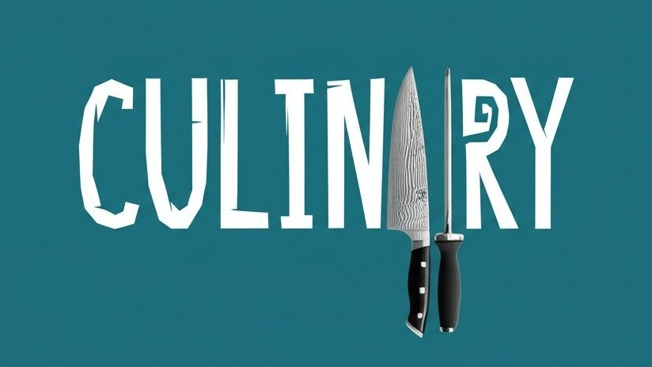

# CulinAIry - Smart AI-Powered Meal Planning



CulinAIry is an AI-powered meal planning assistant that makes cooking simple, fun, and inspiring. This repository contains the landing page for the CulinAIry application.

## Project Overview

CulinAIry helps users with effortless meal planning through:
- AI-curated recipes based on preferences and dietary needs
- Step-by-step visual cooking guides
- Smart shopping lists that prevent unnecessary purchases
- Intelligent meal planning calendar that adapts to your schedule

## Features

### Smart Recipe Recommendations
Our AI analyzes your preferences, dietary needs, and ingredient availability to suggest personalized recipes you'll love.

### Smart Shopping Lists
Streamline your shopping experience with automated, well-structured grocery lists that combine ingredients and prevent unnecessary purchases.

### Intelligent Meal Planning Calendar
Plan your meals with an AI-powered calendar that adapts to your schedule, suggests optimal meal timing, and helps reduce food waste by recommending creative ways to use leftovers.

### AI-Generated Food Visuals
Get inspired with beautiful AI-generated images of completed recipes and step-by-step cooking guides.

## Technology Stack

- **Framework**: [Next.js](https://nextjs.org/) (v15.2.0)
- **UI Library**: [React](https://reactjs.org/) (v18.3.1)
- **Styling**: [Tailwind CSS](https://tailwindcss.com/) (v3.4.17)
- **UI Components**: [Radix UI](https://www.radix-ui.com/)
- **Backend Integration**: [Supabase](https://supabase.io/) for waitlist management

## Getting Started

### Prerequisites

- Node.js (v18 or higher recommended)
- npm, yarn, pnpm, or bun

### Installation

1. Clone the repository
   ```bash
   git clone <repository-url>
   cd culinairy-landing-page
   ```

2. Install dependencies
   ```bash
   npm install
   # or
   yarn install
   # or
   pnpm install
   # or
   bun install
   ```

3. Set up environment variables (if needed)
   - Create a `.env.local` file based on the Supabase setup instructions in `SUPABASE_SETUP.md`

### Development

Run the development server:

```bash
npm run dev
# or
yarn dev
# or
pnpm dev
# or
bun dev
```

Open [http://localhost:3000](http://localhost:3000) with your browser to see the result.

## Project Structure

```
├── public/             # Static assets
│   └── images/         # Image files
├── src/
│   ├── app/            # Next.js App Router
│   │   ├── api/        # API routes
│   │   ├── privacy/    # Privacy policy page
│   │   ├── globals.css # Global styles
│   │   ├── layout.tsx  # Root layout
│   │   └── page.tsx    # Home page
│   ├── components/     # React components
│   │   ├── ui/         # UI components
│   │   └── ...         # Feature components
│   └── lib/            # Utility functions and libraries
├── tailwind.config.js  # Tailwind CSS configuration
└── next.config.mjs     # Next.js configuration
```

## Deployment

The project is configured for deployment on Netlify with the included `netlify.toml` configuration file.

For other deployment options, refer to the [Next.js deployment documentation](https://nextjs.org/docs/app/building-your-application/deploying).

## License

This project is proprietary and confidential.

## Contact

For questions or inquiries, please contact [hello@culinairy.ai](mailto:hello@culinairy.ai).
